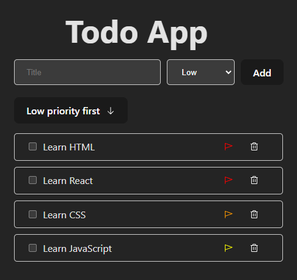

# Todo App

## Inleiding:
In deze opdracht gaan we een Todo App bouwen met behulp van React. De app zal een lijst van taken weergeven, waarbij elke taak een titel, een complete status, een prioriteitsniveau en een omschrijving heeft. We gaan functionaliteiten maken om nieuwe taken toe te voegen, bestaande taken te verwijderen, de complete status van een taak te wijzigen en de taken te sorteren op basis van hun prioriteitsniveau.



## Gedetailleerde opdracht omschrijving:

1. Begin met het maken van een array van taken. Elke taak is een object met de volgende key-value pairs: id, title, completed, priority en description (deze gaan we in de volgende les gebruiken). De id is een unieke identifier voor elke taak. Je mag dit doen adhv een timestamp of gebruik hiervoor [uuid v4](https://www.npmjs.com/package/uuid) bibliotheek. De titel is een string die de taak beschrijft. De voltooide key is een boolean die aangeeft of de taak al dan niet is voltooid. De prioriteit is een getal dat het prioriteitsniveau van de taak aangeeft (1 is hoogste prio en 3 de laagste prio). En de beschrijving is een string met een gedetailleerde taak omschrijving. Log deze lijst binnen je App.jsx.


2. Binnen je App component definieer je een aantal state variabelen met behulp van de useState hook. Deze variabelen zijn: todos (de array van taken), inputValue (de huidige waarde van het invoerveld voor het toevoegen van nieuwe taken), priority (het prioriteitsniveau van de nieuwe taak), completed (de voltooiingsstatus van de nieuwe taak) en sorted (een boolean die aangeeft of de taken al dan niet zijn gesorteerd op prioriteit). Deze gaan we in onze functies gebruiken om de taken te beheren.


3. In de return statement van de App component, maak je een form element voor het toevoegen van nieuwe taken. Dit form element bevat een input veld, een select veld voor het kiezen van het prioriteitsniveau en een submit knop. Zorg ervoor dat de waarden van deze velden worden toegevoegd aan de bijbehorende state variabelen. Gebruik hiervoor de onChange event handler en de value attributen van de input en select elementen (kortom; maak er controlled components van).


4. Maak een functie genaamd addTodo die wordt aangeroepen wanneer het form element wordt ingediend. Gebruik de preventDefault methode om te voorkomen dat de pagina wordt herladen. Gebruik een onSubmit event handler om deze functie aan het form element te koppelen. Deze functie maakt een nieuw todo object met de huidige waarden van de inputValue, priority en completed state variabelen, en voegt dit object toe aan de todos array met behulp van de spread operator en de bijbehorende setter. Let er op dat je de id van de nieuwe taak niet vergeet.
-  _Bonus: Check ook of de inputValue niet leeg is voordat je een nieuwe taak toevoegt en reset ook aan het einde de inputValue, priority en completed state variabelen naar hun beginwaarden._


5. Maak een functie genaamd deleteTask die een taak verwijdert uit de todos array. Deze functie neemt de id van de te verwijderen taak als parameter en gebruikt de filter methode om een nieuwe array te maken die alle taken behalve de te verwijderen taak bevat. Ook hier wordt de todos state variabele bijgewerkt. Je gaat dus door elke taak in de todos array en voert een test uit: als de id van de huidige taak niet gelijk is aan de id die is doorgegeven aan de deleteTask functie, dan wordt de taak opgenomen in de nieuwe array. Als de id's wel overeenkomen, dan wordt de taak uitgesloten van de nieuwe array.


6. Maak een functie genaamd toggleCompleted die de complete status van een taak wijzigt. Deze functie neemt de id van de taak als parameter (idParam) en gebruikt de map methode om een nieuwe array te maken waarin de complete status van de betreffende taak is omgekeerd. De map methode gaat door elke taak in de todos array en voert een test uit: als de id van de huidige taak gelijk is aan de idParam die is doorgegeven aan de toggleCompleted functie, dan wordt een nieuw object geretourneerd dat alle eigenschappen van de huidige taak bevat (dit wordt gedaan met de spread operator: ...todo), maar met de completed eigenschap omgekeerd (dus als het true was, wordt het false, en vice versa). Zorg dat je de todos state variabele bijwerkt met de nieuwe array.


7. Maak die functies genaamd sortTodos, sortOnHighPriority en sortOnLowPriority die de taken sorteren op basis van hun prioriteitsniveau. De sortTodos functie is een algemene sorteerfunctie die de sortOnHighPriority en sortOnLowPriority als argument kan ontvangen (een callback functie). Deze comparator functie bepaalt de gesorteerde lijst van de taken. Binnen de sortTodos functie wordt eerst een nieuwe array gemaakt die een kopie is van de huidige todos array. Dit wordt gedaan met behulp van de spread operator. Vervolgens wordt de sort methode aangeroepen op deze nieuwe array, met de comparator functie als argument. Ten slotte wordt de setTodos functie aangeroepen om de huidige staat van de todos bij te werken naar de gesorteerde array. De sortOnHighPriority sorteert de taken in oplopende volgorde van prioriteit, wat betekent dat taken met een hogere prioriteit (lagere prioriteitswaarde) eerst komen. Na het sorteren wordt de setSorted functie aangeroepen om de huidige staat van de sorted variabele bij te werken naar false. Andersom sorteert de sortOnLowPriority functie de taken in aflopende volgorde van prioriteit, wat betekent dat taken met een lagere prioriteit (hogere prioriteitswaarde) eerst komen. Na het sorteren wordt de setSorted functie aangeroepen om de huidige staat van de sorted variabele bij te werken naar true.


8. In de return statement van de App component, map over de todos array en geef voor elke taak een li element weer. Dit li element bevat een checkbox voor het wijzigen van de voltooiingsstatus van de taak, een span element voor het weergeven van de titel van de taak, en een button voor het verwijderen van de taak. Gebruik destructuring om de id, titel, voltooide en prioriteit waarden uit elke taak te halen.
- _Bonus: Gebruik de prioriteit om de achtergrondkleur van het li element te veranderen. Gebruik hiervoor een inline style object en de prioriteit als key voor het backgroundColor attribuut. Gebruik ook een ternary operator om de kleur van de tekst te veranderen, afhankelijk van de prioriteit (bijvoorbeeld als de prioriteit 1 is, dan is de tekstkleur rood, bij prioriteit 2 is de tekstkleur oranje, en bij prioriteit 3 is de tekstkleur groen)._
- _Bonus: Gebruik [Phosphor icons](https://phosphoricons.com/) om een flaggentje weer te geven voor taken met een hoge prioriteit, een uitroepteken voor taken met een gemiddelde prioriteit en een vinkje voor taken met een lage prioriteit._
- _Bonus: Gebruik [Phosphor icons](https://phosphoricons.com/) om een pijltje omhoog weer te geven voor taken met een hoge prioriteit, een pijltje omlaag voor taken met een gemiddelde prioriteit en een pijltje naar rechts voor taken met een lage prioriteit._

10. Voeg ook een button toe voor het sorteren van de taken op basis van hun prioriteitsniveau. Deze button roept de sortOnHighPriority of sortOnLowPriority functie aan, afhankelijk van de huidige waarde van de sorted state variabele. een todo lijstje. 
- _Bonus: Gebruik [Phosphor icons](https://phosphoricons.com/) om een prullenbak icoon weer te geven voor de verwijder knop._


11. Maak een functionele component aan voor het weergeven van een taak. Deze component neemt een todo object als parameter en geeft een li element weer met een checkbox, een span element en een button. Gebruik destructuring om de id, titel, voltooide en prioriteit waarden uit het todo object te halen. Gebruik deze component in de App component om de taken weer te geven.

12. **Routing:** geef de applicatie drie pagina's op verschillende url's:
    * De home-pagina met alle todo's erop;
    * Een "about me"-pagina met informatie over jou als ontwikkelaar;
    * Een todo-detail-pagina waarop uiteindelijk alle detailinformatie van één todo wordt weergegeven. Dit moet een _dynamic route_ zijn;
    Houdt er rekening mee dat we - behalve de unieke identifier - nog geen detail-informatie over een todo kunnen weergeven op de detailpagina, hier hebben we een backend voor nodig. Wel richt je de detailpagina alvast in met dummy-data en zorg je er met state voor dat de gebruiker kan togglen tussen 'weergeven' en 'bewerken', waarin er invoervelden verschijnen.

13. **Routing:** Maak er ook een mooie menubalk bij!
    
#### Requests maken - deel 1

14. Tijd voor een backend! Clone de [fake backend](https://github.com/hogeschoolnovi/frontend-fake-database/tree/main) naar jouw eigen computer en start deze op volgens de instructies. Lees de documentatie goed door, zodat je weet welke endpoints er beschikbaar zijn. Op basis van de volgende opdrachten zul je namelijk zelf moeten bedenken waar het request naartoe moet. *Dikke tip:* begin een nieuw, schoon frontend projectje zodat je onbezorgd kunt oefenen met de requests, voordat je dit implementeert in je bestaande to-do applicatie. Scheelt een hoop kopzorgen!
15. **To-do's ophalen**: maak een tijdelijke button (`haal taken op`) zodat je daar jouw asynchrone functie aan kunt koppelen. Maak een request naar de backend om *alle* to-do's op te halen en log deze in de console;
16. **Nieuwe to-do toevoegen:** maak nog een button (`nieuwe toevoegen`) en zorg ervoor dat er een nieuwe todo wordt toegevoegd aan de database wanneer de gebruiker hierop klikt. Dit mag je voor nu doen met hardcoded-tekst. Zorg er wel voor dat de`id` en de `created`-datum gegenereerd worden en er een succesmelding in de console wordt gelogd;
17. Check, check, dubbelcheck: als je nu opnieuw alle todo's ophaalt door op de `haal taken op`-knop te klikken, staat jouw toegevoegde to-do daar nu bij? :heart_eyes:
18. **To-do verwijderen**: maak een button (`verwijder eerste todo`) en gebruik de `id` van de *eerste* to-do om deze uit de backend te verwijderen. Deze `id` mag je gewoon even overtypen. Zorg ervoor dat er bij success een melding in de console wordt gelogd;
19.  **To do aanpassen:** kies een to-do waarvan je de beschrijving wil wijzigen en gebruik daar de `id` van om een wijzig-request te maken. Let erop dat je alle huidige informatie van de to-do meestuurt - ook de velden die niet worden aangepast! -  anders verlies je gegevens. Controleer of de wijziging gelukt is door daarna weer op de `haal taken op`-knop te klikken.

#### Requests maken - deel 2

20. Tijd voor de implementatie in jouw app! We willen op de todo-pagina natuurlijk direct beginnen met het ophalen en weergeven van alle to-do's. Om dit mogelijk te maken *zonder* eerst op een knopje te drukken, zul je het request moeten **maken en aanroepen** binnen een effect-hook*:

```jsx
function JouwPagina() {
  useEffect(() => {
    async function fetchAllTodos() {
      //.. haal de taken op en zet ze in de state!
    }
    
    fetchAllTodos();
  }, []);

  return (
    <></>
  ); 
}
```

​	Wanneer je de gegevens in de state hebt gezet, kun je de todo's weergeven op de pagina.

21. Op dit moment verloopt het toevoegen van een nieuwe to-do enkel via de State. Breidt de huidige logica daarom uit, door de nieuwe todo eerst naar de backend te sturen. Pas als de backend laat weten dat de nieuwe todo succesvol is toegevoegd, zet je deze in de State. *Leuk nieuws:* als je nu de pagina zou verversen, blijft ook de nieuwe to-do staan! Wuhuuu!
22. Ook het verwijderen van een to-do verloopt nog niet via de backend. Zorg ervoor dat wanneer de gebruiker één van de todos wil verwijderen, je *eerst* een verzoek maakt naar de backend. Als het verwijderen succesvol was, mag de todo ook uit de state verwijderd worden zodat de gebruiker ziet dat het gelukt is.
23. Wanneer de gebruiker naar de detailpagina van een todo navigeert, is deze pagina verantwoordelijk voor het weergeven van de detail-informatie, op basis van de url. Tot nu toe geven we alleen de `id` weer, maar daar gaan we nu verandering in brengen! Zorg ervoor dat de detail-pagina alle informatie over de aangeklikte todo ophaalt en weergeeft op de pagina. *Let op:* ook dit moet weer in een effect-hook.
24. Weergeven is leuk, maar we willen de gebruiker ook de kans geven de gegevens aan te passen. Wanneer de gebruiker op 'wijzigen' drukt en één (of meerdere) velden heeft aangepast, moet dit wijzigingsverzoek naar de backend worden verzonden.
25. Wanneer de gebruiker na het maken van aanpassingen in het formulier toch van gedachten veranderd, moet er een annuleer-mogelijkheid bestaan. Annuleren zorgt ervoor dat er geen request naar de backend gestuurd wordt. Het formulier moet dan weer worden teruggezet naar de originele waardes. 
26. Ook het afstrepen van een taak moet via de backend verlopen. Zorg ervoor dat wanneer een gebruiker diens taak afstreept in het overzicht, er eerst een wijzigingsverzoek naar de backend wordt verstuurd. Wanneer je de pagina na het afstrepen van een taak ververst, zou de taak nog steeds afgestreept moeten zijn.
27. **Bonus:** plaats alle informatie die op de About-pagina moet komen te staan in JSON-format in de backend (behalve de afbeeldingen). Op deze manier kun je de content voor deze pagina ophalen via een request, alvorens dit wordt weergegeven op de pagina!

*Hoe effect-hooks in React precies werken, zullen we niet behandelen. Je mag voor nu simpelweg aannemen dat dit nodig is om niet in een never-ending-loop terecht te komen. Als je toch erg nieuwschierig bent naar effect-hooks en life cycles, kun je altijd hoofdstuk 9 op EdHub doorlezen!

20. Make it pretty! Stijl je app met behulp van CSS. Gebruik hiervoor een CSS bestand en importeer deze in je App component.
